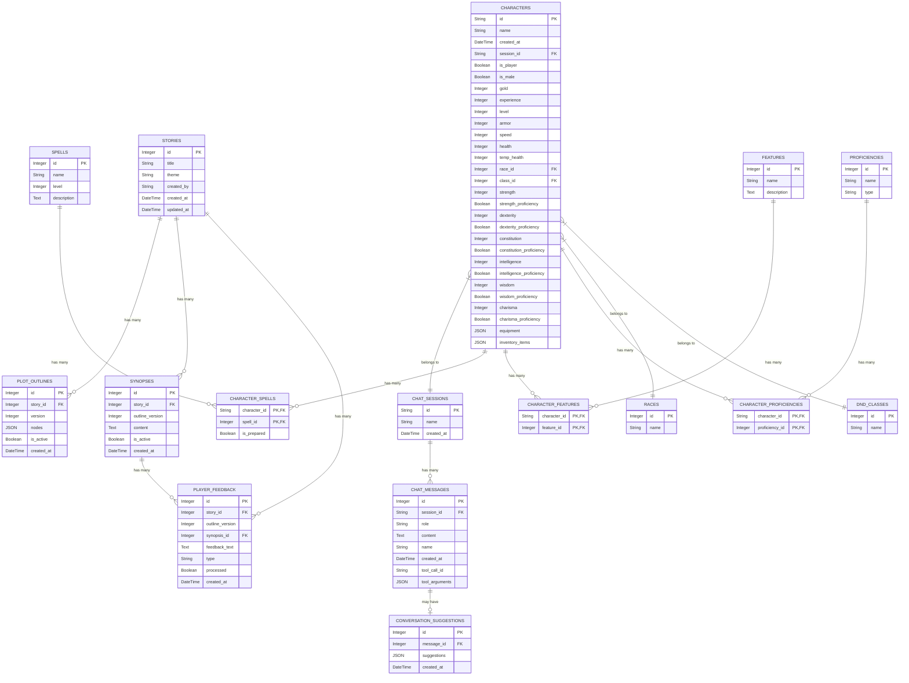

# 数据库设计文档

本文档详细描述了系统的数据库结构设计，包括表结构、字段定义和关系设计。

## 核心表

### 1. `chat_sessions`

存储聊天会话的基本信息。

| 字段名       | 数据类型   | 约束                     | 描述                 |
| :----------- | :--------- | :----------------------- | :------------------- |
| `id`         | `String`   | 主键, 索引, 默认 UUID v4 | 聊天会话的唯一标识符 |
| `name`       | `String`   | 可为空                   | 聊天会话的名称       |
| `created_at` | `DateTime` | 默认当前时间             | 聊天会话的创建时间   |

**关系:**
*   与 `chat_messages` 表通过 `messages` 建立一对多关系。

### 2. `chat_messages`

存储聊天会话中的具体消息，包含工具调用信息。使用时间戳排序。

| 字段名           | 数据类型   | 约束                                           | 描述                                                     |
| :--------------- | :--------- | :--------------------------------------------- | :------------------------------------------------------- |
| `id`             | `Integer`  | 主键, 索引, 自增                               | 聊天消息的唯一标识符                                     |
| `session_id`     | `String`   | 外键 (REFERENCES `chat_sessions.id`), 不可为空 | 该消息所属的聊天会话 ID                                  |
| `role`           | `String`   | 不可为空                                       | 消息发送者的角色 ("user", "assistant", "system", "tool") |
| `content`        | `Text`     | 可为空                                         | 消息的具体内容 (当助手进行工具调用时可为空)              |
| `name`           | `String`   | 可为空                                         | 工具的名称（仅对 tool 角色有效）                         |
| `created_at`     | `DateTime` | 默认当前时间                                   | 消息的创建时间（用于排序）                               |
| `tool_call_id`   | `String`   | 可为空                                         | 工具调用ID（用于关联工具调用请求和响应）                 |
| `tool_arguments` | `JSON`     | 可为空                                         | 工具调用参数（JSON格式，仅用于 assistant 角色）          |

**关系和查询优化:**
*   与 `chat_sessions` 表通过 `session_id` 建立多对一关系。
*   通过 `ORDER BY created_at ASC` 获取有序消息。
*   Assistant 角色的消息通过 `tool_call_id` 和 `tool_arguments` 存储工具调用信息。
*   Tool 角色的消息通过 `tool_call_id` 关联到对应的工具调用。

**工具调用字段使用规则:**
1. **Assistant 角色发起工具调用**:
   - `content`: 可为 null（如果没有附带文本）
   - `name`: 工具名称
   - `tool_call_id`: 工具调用的唯一标识符
   - `tool_arguments`: 工具参数（JSON对象）

2. **Tool 角色返回工具结果**:
   - `content`: 工具执行结果（字符串）
   - `name`: 工具名称
   - `tool_call_id`: 对应的工具调用ID（与 assistant 消息中的 ID 匹配）
   - `tool_arguments`: null（不使用）

3. **User 和 System 角色**:
   - 这些角色不涉及工具调用，所有工具相关字段均为 null

### 3. `characters`

存储龙与地下城 (D&D) 游戏角色的核心信息。

| 字段名                     | 数据类型   | 约束                                           | 描述                                                                                                                  |
| :------------------------- | :--------- | :--------------------------------------------- | :-------------------------------------------------------------------------------------------------------------------- |
| `id`                       | `String`   | 主键, 索引, 默认 UUID v4                       | 角色的唯一标识符                                                                                                      |
| `name`                     | `String`   | 不可为空                                       | 角色的名称                                                                                                            |
| `created_at`               | `DateTime` | 默认当前时间                                   | 角色的创建时间                                                                                                        |
| `gold`                     | `Integer`  | 默认 15                                        | 角色拥有的金币数量                                                                                                    |
| `experience`               | `Integer`  | 默认 0                                         | 角色的经验值                                                                                                          |
| `level`                    | `Integer`  | 默认 1                                         | 角色的等级                                                                                                            |
| `armor`                    | `Integer`  | 默认 10                                        | 角色的护甲等级 (AC)                                                                                                   |
| `speed`                    | `Integer`  | 默认 30                                        | 角色的速度                                                                                                            |
| `health`                   | `Integer`  | 默认 10                                        | 角色的当前生命值 (HP)                                                                                                 |
| `temp_health`              | `Integer`  | 默认 0                                         | 角色的临时生命值                                                                                                      |
| `race_id`                  | `Integer`  | 外键 (REFERENCES `races.id`), 不可为空         | 角色的种族 ID                                                                                                         |
| `class_id`                 | `Integer`  | 外键 (REFERENCES `dnd_classes.id`), 不可为空   | 角色的职业 ID                                                                                                         |
| `session_id`               | `String`   | 外键 (REFERENCES `chat_sessions.id`), 不可为空 | 关联的聊天会话 ID                                                                                                     |
| `strength`                 | `Integer`  | 默认 10                                        | 角色的力量属性值                                                                                                      |
| `strength_proficiency`     | `Boolean`  | 默认 False                                     | 角色是否拥有力量豁免熟练项                                                                                            |
| `dexterity`                | `Integer`  | 默认 10                                        | 角色的敏捷属性值                                                                                                      |
| `dexterity_proficiency`    | `Boolean`  | 默认 False                                     | 角色是否拥有敏捷豁免熟练项                                                                                            |
| `constitution`             | `Integer`  | 默认 10                                        | 角色的体质属性值                                                                                                      |
| `constitution_proficiency` | `Boolean`  | 默认 False                                     | 角色是否拥有体质豁免熟练项                                                                                            |
| `intelligence`             | `Integer`  | 默认 10                                        | 角色的智力属性值                                                                                                      |
| `intelligence_proficiency` | `Boolean`  | 默认 False                                     | 角色是否拥有智力豁免熟练项                                                                                            |
| `wisdom`                   | `Integer`  | 默认 10                                        | 角色的感知属性值                                                                                                      |
| `wisdom_proficiency`       | `Boolean`  | 默认 False                                     | 角色是否拥有感知豁免熟练项                                                                                            |
| `charisma`                 | `Integer`  | 默认 10                                        | 角色的魅力属性值                                                                                                      |
| `charisma_proficiency`     | `Boolean`  | 默认 False                                     | 角色是否拥有魅力豁免熟练项                                                                                            |
| `is_player`                | `Boolean`  | 默认 False                                     | 角色是否为玩家控制（此值仅应该当角色是玩家创建时为True，NPC角色应该为False）                                          |
| `is_male`                  | `Boolean`  | 默认 False                                     | 角色性别（此值仅应该当角色是男性时为True，女性角色应该为False）                                                       |
| `ability_scores`           | `JSON`     | 不可为空, 默认空对象                           | 角色的初始属性值 (格式: `{"strength": 15, "dexterity": 10, ...}`)                                                     |
| `proficiency_ids`          | `JSON`     | 不可为空, 默认空列表                           | 角色选择的技能熟练项 ID 列表                                                                                          |
| `equipment_ids`            | `JSON`     | 不可为空, 默认空列表                           | 角色初始装备的 ID 列表                                                                                                |
| `half_elf_choices`         | `JSON`     | 可为空                                         | 半精灵种族的属性选择（需要选择两个除魅力外的属性）                                                                    |
| `equipment`                | `JSON`     | 可为空, 默认空对象                             | 角色拥有的装备 (格式: `{"装备名": {"item_name": "装备名", "item_description": "装备描述", "item_quantity": 数量}}`)   |
| `inventory_items`          | `JSON`     | 可为空, 默认空对象                             | 角色背包中的物品 (格式: `{"物品名": {"item_name": "物品名", "item_description": "物品描述", "item_quantity": 数量}}`)。实际创建时后端会自动加入基础三件物品：`packsack`、`food (1day)`、`water bag`。 |

**关系:**
*   与 `races` 表通过 `race_id` 建立多对一关系。
*   与 `dnd_classes` 表通过 `class_id` 建立多对一关系。
*   与 `chat_sessions` 表通过 `session_id` 建立多对一关系，允许通过会话 ID 查询与该会话关联的所有角色 (一个角色必须属于一个聊天会话，一个聊天会话可以拥有多个角色)。
*   与 `character_spells`, `character_features`, `character_proficiencies` 等关联表建立一对多关系。
*   通过 `equipment` 和 `inventory_items` JSON 字段直接存储装备和物品信息，每个物品包含名称、描述和数量。

## 静态数据表 (D&D 基础数据)

这些表存储来自 `dnd_data.json` 的静态数据，用于查找。ID 通常对应 JSON 中的键。

### 4. `races`

存储种族信息。

| 字段名 | 数据类型  | 约束           | 描述     |
| :----- | :-------- | :------------- | :------- |
| `id`   | `Integer` | 主键           | 种族 ID  |
| `name` | `String`  | 唯一, 不可为空 | 种族名称 |

### 5. `dnd_classes`

存储职业信息。

| 字段名 | 数据类型  | 约束           | 描述     |
| :----- | :-------- | :------------- | :------- |
| `id`   | `Integer` | 主键           | 职业 ID  |
| `name` | `String`  | 唯一, 不可为空 | 职业名称 |

### 6. `spells`

存储法术信息。

| 字段名        | 数据类型  | 约束           | 描述            |
| :------------ | :-------- | :------------- | :-------------- |
| `id`          | `Integer` | 主键           | 法术 ID         |
| `name`        | `String`  | 唯一, 不可为空 | 法术名称        |
| `level`       | `Integer` | 可为空         | 法术环位 (可选) |
| `description` | `Text`    | 可为空         | 法术描述 (可选) |

### 7. `features`

存储特性信息。

| 字段名        | 数据类型  | 约束           | 描述            |
| :------------ | :-------- | :------------- | :-------------- |
| `id`          | `Integer` | 主键           | 特性 ID         |
| `name`        | `String`  | 唯一, 不可为空 | 特性名称        |
| `description` | `Text`    | 可为空         | 特性描述 (可选) |

### 8. `proficiencies`

存储熟练项信息。

| 字段名 | 数据类型  | 约束           | 描述                            |
| :----- | :-------- | :------------- | :------------------------------ |
| `id`   | `Integer` | 主键           | 熟练项 ID                       |
| `name` | `String`  | 唯一, 不可为空 | 熟练项名称                      |
| `type` | `String`  | 可为空         | 熟练项类型 (技能, 工具等，可选) |

## 关联表 (Junction Tables for Characters)

这些表用于处理 `characters` 表与其他静态数据表之间的多对多关系。

### 12. `character_spells`

连接角色和他们掌握的法术。

| 字段名         | 数据类型  | 约束                                    | 描述       |
| :------------- | :-------- | :-------------------------------------- | :--------- |
| `character_id` | `String`  | 外键 (REFERENCES `characters.id`), 主键 | 角色 ID    |
| `spell_id`     | `Integer` | 外键 (REFERENCES `spells.id`), 主键     | 法术 ID    |
| `is_prepared`  | `Boolean` | 默认 False (可选)                       | 是否已准备 |

### 13. `character_features`

连接角色和他们拥有的特性。

| 字段名         | 数据类型  | 约束                                    | 描述    |
| :------------- | :-------- | :-------------------------------------- | :------ |
| `character_id` | `String`  | 外键 (REFERENCES `characters.id`), 主键 | 角色 ID |
| `feature_id`   | `Integer` | 外键 (REFERENCES `features.id`), 主键   | 特性 ID |

### 14. `character_proficiencies`

连接角色和他们的熟练项。

| 字段名           | 数据类型  | 约束                                       | 描述      |
| :--------------- | :-------- | :----------------------------------------- | :-------- |
| `character_id`   | `String`  | 外键 (REFERENCES `characters.id`), 主键    | 角色 ID   |
| `proficiency_id` | `Integer` | 外键 (REFERENCES `proficiencies.id`), 主键 | 熟练项 ID |

## 对话选项表

### 15. `conversation_suggestions`

存储对话选项，与聊天消息关联。

| 字段名        | 数据类型   | 约束                                           | 描述                       |
| :------------ | :--------- | :--------------------------------------------- | :------------------------- |
| `id`          | `Integer`  | 主键, 索引, 自增                               | 选项记录的唯一标识符       |
| `message_id`  | `Integer`  | 外键 (REFERENCES `chat_messages.id`), 不可为空 | 关联的消息ID               |
| `suggestions` | `JSON`     | 不可为空                                       | 选项数组，格式为字符串列表 |
| `created_at`  | `DateTime` | 默认当前时间                                   | 选项创建的时间             |

## 配置表

### 16. `config_entries`

存储运行时配置（如 OpenAI/RAG 相关的密钥、模型等），支持通过 API 更新并优先于环境变量。

| 字段名       | 数据类型   | 约束                   | 描述                                |
| :----------- | :--------- | :--------------------- | :---------------------------------- |
| `key`        | `String`   | 主键, 索引             | 配置项名称（例如 `OPENAI_API_KEY`） |
| `value`      | `String`   | 可为空                 | 配置值，允许为 `null` 表示未设置    |
| `updated_at` | `DateTime` | 默认当前时间，自动更新 | 最近更新时间                        |

> 说明：应用首次启动会将 `.env` 中的目标配置落库（缺失则存 `null`）；运行时读取始终以数据库记录为准。

**关系:**
*   与 `chat_messages` 表通过 `message_id` 建立多对一关系。

## 剧情梗概系统表

### 16. `stories`

存储故事的基本信息。

| 字段名        | 数据类型   | 约束                     | 描述     |
| :------------ | :--------- | :----------------------- | :------- |
| `id`          | `Integer`  | 主键, 索引, 自增         | 故事ID   |
| `title`       | `String`   | 不可为空                 | 故事标题 |
| `theme`       | `String`   | 可为空                   | 故事主题 |
| `created_by`  | `String`   | 可为空                   | 创建者   |
| `created_at`  | `DateTime` | 默认当前时间             | 创建时间 |
| `updated_at`  | `DateTime` | 默认当前时间，更新时更新 | 更新时间 |

**关系:**
*   与 `plot_outlines` 表通过 `outlines` 建立一对多关系。
*   与 `synopses` 表通过 `synopses` 建立一对多关系。
*   与 `player_feedback` 表通过 `feedbacks` 建立一对多关系。

### 17. `plot_outlines`

存储故事的剧情列表，支持版本管理。

| 字段名        | 数据类型   | 约束                                     | 描述                   |
| :------------ | :--------- | :--------------------------------------- | :--------------------- |
| `id`          | `Integer`  | 主键, 索引, 自增                         | 剧情列表ID             |
| `story_id`    | `Integer`  | 外键 (REFERENCES `stories.id`), 不可为空 | 关联的故事ID           |
| `version`     | `Integer`  | 不可为空, 默认 1                         | 剧情列表版本号         |
| `nodes`       | `JSON`     | 不可为空                                 | 序列化后的剧情节点列表 |
| `is_active`   | `Boolean`  | 默认 True                                | 是否为激活的剧情列表   |
| `created_at`  | `DateTime` | 默认当前时间                             | 创建时间               |

**关系与约束:**
*   与 `stories` 表通过 `story_id` 建立多对一关系。
*   每个故事可以有多个版本的剧情列表，但只有一个激活的版本。
*   `nodes` 数组中每个节点的 `status` 取值必须为 `Pending`、`InProgress`、`Finish` 或 `Canceled`；至少有一个节点的 `is_ending` 应为 `true`。

**剧情节点 JSON 示例:**
```json
[
  {
    "index": 1,
    "title": "新手村",
    "status": "Pending",
    "is_ending": false,
    "summary": "玩家在村庄中开始冒险"
  },
  {
    "index": 2,
    "title": "森林探险",
    "status": "Pending",
    "is_ending": false,
    "summary": "探索神秘的森林"
  }
]
```

### 18. `synopses`

存储故事梗概，与剧情列表版本关联。

| 字段名            | 数据类型   | 约束                                     | 描述                 |
| :---------------- | :--------- | :--------------------------------------- | :------------------- |
| `id`              | `Integer`  | 主键, 索引, 自增                         | 梗概ID               |
| `story_id`        | `Integer`  | 外键 (REFERENCES `stories.id`), 不可为空 | 关联的故事ID         |
| `outline_version` | `Integer`  | 不可为空                                 | 关联的剧情列表版本号 |
| `content`         | `Text`     | 不可为空                                 | 梗概内容             |
| `is_active`       | `Boolean`  | 默认 True                                | 是否为激活的梗概     |
| `created_at`      | `DateTime` | 默认当前时间                             | 创建时间             |

**关系:**
*   与 `stories` 表通过 `story_id` 建立多对一关系。
*   与 `player_feedback` 表通过 `feedbacks` 建立一对多关系。
*   每个故事可以有多个版本的梗概，但只有一个激活的版本。

### 19. `player_feedback`

存储玩家对故事的反馈。

| 字段名            | 数据类型   | 约束                                     | 描述                               |
| :---------------- | :--------- | :--------------------------------------- | :--------------------------------- |
| `id`              | `Integer`  | 主键, 索引, 自增                         | 反馈ID                             |
| `story_id`        | `Integer`  | 外键 (REFERENCES `stories.id`), 不可为空 | 关联的故事ID                       |
| `outline_version` | `Integer`  | 可为空                                   | 反馈时的剧情列表版本号             |
| `synopsis_id`     | `Integer`  | 可为空                                   | 反馈时的梗概ID                     |
| `feedback_text`   | `Text`     | 不可为空                                 | 反馈内容                           |
| `type`            | `String`   | 不可为空                                 | 反馈类型 (`ModifyExisting`/`CreateNew`) |
| `processed`       | `Boolean`  | 默认 False                               | 是否已处理                         |
| `created_at`      | `DateTime` | 默认当前时间                             | 创建时间                           |

**关系:**
*   与 `stories` 表通过 `story_id` 建立多对一关系。
*   与 `synopses` 表通过 `synopsis_id` 建立多对一关系。

## 实体关系图 (ERD) 概念



**注意:**
*   静态数据表 (`races`, `classes`, `spells`, `features`, `proficiencies`) 中的 `id` 字段建议使用 `Integer` 类型，并对应 `dnd_data.json` 中的键（可能需要类型转换）。
*   在实际的 SQLAlchemy 模型中，这些外键关系会通过 `ForeignKey` 和 `relationship` 来定义。
*   Mermaid ERD 是一个概念图，具体的 SQL 实现可能会有所不同。
*   The `chat_messages.role` field only includes "user", "assistant", "system", and "tool" (the "function" role has been deprecated).
